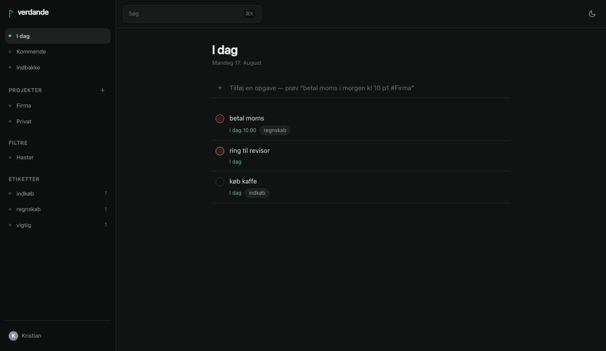
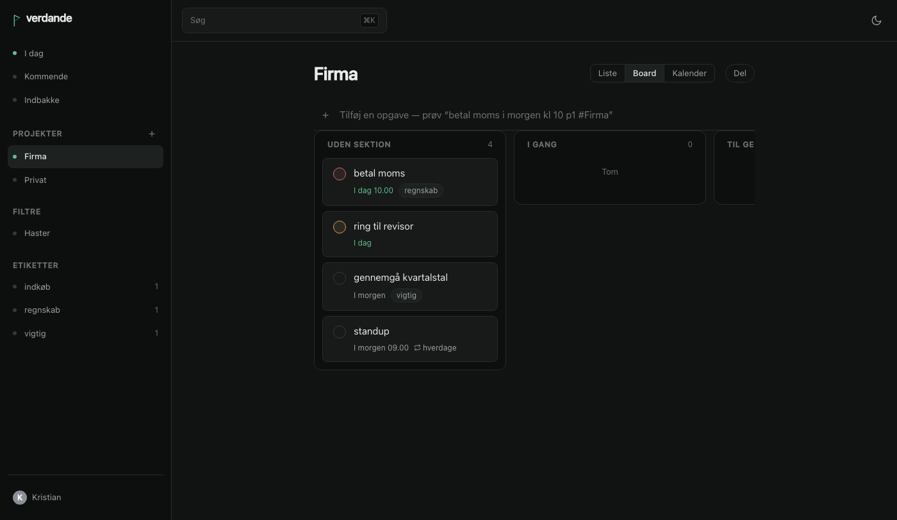
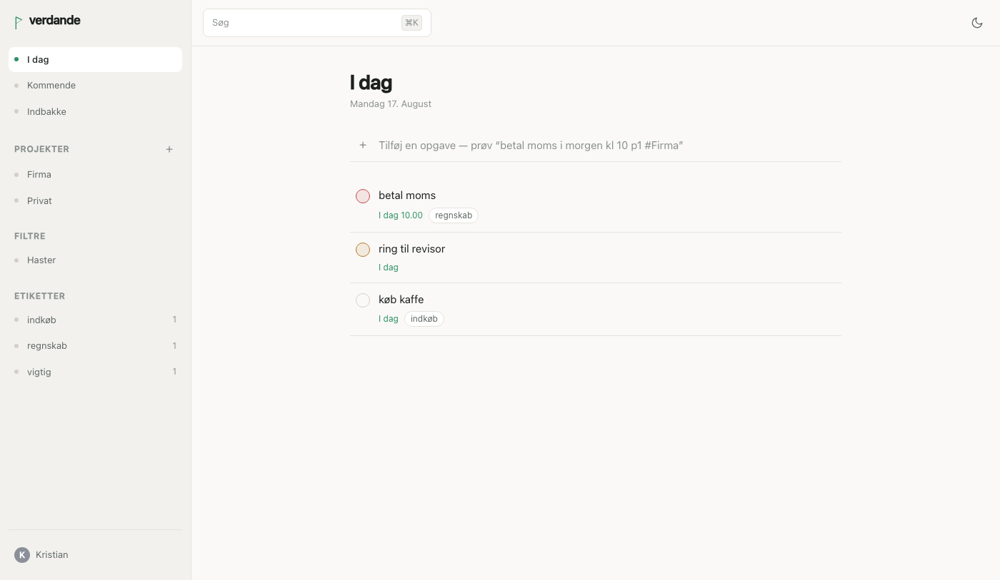

<h1 align="center">verdande</h1>

<p align="center">
  Self-hosted tasks and projects, shared with the people you share the work with.<br>
  One binary, SQLite inside it, deployed as a Rune in Yggdrasil Panel.
</p>

<p align="center">
  
</p>

---

**Verdande** is one of the three Norns — the one who spins *that which is becoming*.
Not what has been, and not what is fated to be: the thing you are in the middle of.
Which is what a to-do list is.

## Status

All six phases are built. See [What works today](#what-works-today) for what is
tested and what is not.

Documentation: [`docs/`](docs/), built with Material for MkDocs.

## Why this exists

Todoist Pro, self-hosted, on your own hardware, with your own data — and with the
integrations that a hosted product will not build for you: a real CalDAV server, a
mail-to-task address, and an MCP endpoint so Claude can work your task list directly.

## What it does

- **Quick add that reads what you type.** `betal moms i morgen kl 10 p1 #Firma
  @regnskab` becomes a task called "betal moms", due tomorrow at 10:00, priority 1,
  in Firma, labelled regnskab. Danish and English, mixed freely in one line.
- **Projects, sections, sub-tasks, labels, saved filters.** List, board and calendar
  views, and foldable groups over the projects in the sidebar.
- **Drag where it means something.** Reorder a list or a board, file a project under
  a group, drop a task on another project, or drop it on another day.
- **Sharing.** Owner, editor and viewer roles. There is no open registration:
  everybody arrives through an invite link, either to a project or — from
  **Settings → Brugere** — to the instance itself. Nobody's password is ever chosen
  by somebody else.
- **Live sync.** A change made by somebody else appears without a refresh.
- **Recurring tasks** as RRULE (RFC 5545), reminders, comments and attachments.
- **Standards, not homegrown formats.** iCalendar and CalDAV, ICS feeds, OAuth2 with
  PKCE, OpenAPI 3.1, MCP, Web Push, Argon2id.
- **A PWA that works on a phone**, installable, with swipe gestures and offline
  reading of what it has already cached.

## What works today

**Every phase in the plan is built.** You can install it, add tasks by typing a
sentence, share projects, watch somebody else's changes appear live, set repeating
chores and reminders, save filters, import your Todoist account, sync two-way with
Apple Reminders, forward mail into it, and add it to Claude as a connector.

| Area | State |
|---|---|
| SQLite schema, migrations, WAL | Done, tested |
| Full-text search, Danish-aware | Done, tested |
| Quick-add parser (Danish + English) | Done, tested |
| Argon2id passwords, sessions, TOTP, recovery codes | Done, tested |
| Project roles and permission checks | Done, tested |
| REST API: projects, sections, tasks, sub-tasks, ordering | Done, tested |
| Today, Upcoming, search, activity log | Done, tested |
| Waiting on others: what you have delegated, by person | Done, tested |
| Sharing: invites, roles, members | Done, tested |
| Live sync over WebSocket | Done |
| Web interface: sign-in, views, quick add, ⌘K, shortcuts | Done |
| Task detail: description, sub-tasks, comments, files, reminders | Done |
| Settings: account, notifications, integrations, AI, tokens, data | Done |
| Device list: where you are signed in, and signing one out | Done, tested |
| User administration: invite to the instance, promote, remove | Done, tested |
| Invite and password-reset links that open the right page | Done, smoke-tested |
| Drag to reorder, in both the list and the board | Done |
| Drag a task to another project or another day | Done, smoke-tested |
| Foldable project groups in the sidebar | Done, tested |
| Month view on Upcoming, not only per project | Done, smoke-tested |
| Recurring tasks (RRULE, Danish + English) | Done, tested |
| Reminders, absolute and relative | Done, tested |
| Saved filters with a query language | Done, tested |
| Board and calendar views | Done |
| ICS calendar feed, task durations | Done, tested |
| Project templates | Done, tested |
| Nightly backups with rotation | Done, tested |
| Comments, attachments, notifications, Web Push | Built |
| Todoist CSV import and export, account export | Done, tested |
| MCP server for Claude | Done, tested |
| CalDAV server (two-way VTODO) | Done, tested |
| Mail-to-task | Done, tested |
| AI layer (Anthropic/OpenAI/Google/local) | Built, degrades when unconfigured |
| Gmail: OAuth2 with PKCE, polling, one-way to tasks | Done, tested |
| Update notice for administrators | Done, tested |
| Personal API tokens | Done, tested |
| OpenAPI 3.1 spec, checked against the router | Done, tested |
| End-to-end smoke tests (Playwright) | Done |
| Documentation, landing page, licence | Done |

**Not finished:** Web Push, the AI providers and the Gmail API calls are
implemented against their specifications and have only ever been exercised there,
not against live services. Everything else has an interface: opening a task shows
its description, sub-tasks, comments, files and reminders, and the settings pages
cover the account, notifications, integrations, AI, API tokens, import, export and
templates.

Search finds `grøn` when you type `gron`, because Unicode does not consider `ø` an
accented `o` and a Danish-first app that cannot do this is broken for its own users.

## What it looks like

| | |
|---|---|
|  |  |
| Board view — one column per section. | The light theme. |

Regenerate these with `go run ./tools/shots` against a running instance.

## Running it

### As a Rune in Yggdrasil Panel

verdande is built to be deployed as a **Rune** in
[Yggdrasil Panel](https://github.com/kristianwind/yggdrasil) — that is its home,
and the manifest ships in this repository. It runs anywhere Docker does as well.

1. **Runes → Carve a rune (upload)** and pick [`rune/verdande.yaml`](rune/verdande.yaml).
2. Create a server from it.
3. Set **Public address** to the address you will actually reach it on. verdande
   cannot work this out for itself — the host port is not chosen until the server
   exists — and invite links, password resets and calendar feeds are all built from
   it. `{{PUBLIC_URL}}` is the default and is usually right.
4. Point the SMTP settings at your mail server. Leave the host blank and verdande
   shows invite links in the app instead of emailing them, which is fine for a
   single user and no use at all for sharing.
5. Start it, open the URL, create the first account. That account is the admin.

### With Docker directly

```bash
docker run -d --name verdande \
  -p 8080:8080 \
  -v verdande-data:/data \
  -e VERDANDE_BASE_URL=https://todo.example.dk \
  ghcr.io/kristianwind/verdande:latest
```

### From source

```bash
go run ./cmd/verdande
```

Listens on `:8080` and puts its data in `/data`, so for local work set
`VERDANDE_DATA_DIR` somewhere writable:

```bash
VERDANDE_DATA_DIR=./data VERDANDE_DEV=true go run ./cmd/verdande
```

A plain `go build` produces the API without the web interface — the frontend is
embedded only when built with `-tags embedweb`, so a clean checkout compiles
without a Node toolchain installed.

## Configuration

Everything is an environment variable; there is no config file. A Rune has nowhere
to put one that the operator would ever see.

| Variable | Default | What it does |
|---|---|---|
| `VERDANDE_BASE_URL` | `http://localhost:8080` | The public address. Invite links, password resets and ICS feeds are built from it. |
| `VERDANDE_ADDR` | `:8080` | Listen address. |
| `VERDANDE_DATA_DIR` | `/data` | Database, uploaded files and backups. |
| `VERDANDE_SESSION_TTL` | `720h` | How long a login lasts. |
| `VERDANDE_INVITE_TTL` | `168h` | How long an invite link stays valid. |
| `VERDANDE_RESET_TTL` | `1h` | How long a password-reset link stays valid. |
| `VERDANDE_SMTP_HOST` | — | Blank disables outbound mail; invite links are shown in the app instead. |
| `VERDANDE_SMTP_PORT` | `587` | |
| `VERDANDE_SMTP_USER` | — | |
| `VERDANDE_SMTP_PASS` | — | |
| `VERDANDE_SMTP_FROM` | `verdande@localhost` | Sender address. |
| `VERDANDE_SMTP_STARTTLS` | `true` unless port 465 | Port 465 is TLS from the first byte; everything else negotiates. |
| `VERDANDE_SMTP_INSECURE` | `false` | Skip certificate verification. For a self-signed internal mail server, and nothing else. |
| `VERDANDE_GMAIL_CLIENT_ID` | — | OAuth client from Google Cloud, if anyone will connect a mailbox. |
| `VERDANDE_GMAIL_CLIENT_SECRET` | — | |
| `VERDANDE_UPDATE_CHECK` | `false` | Ask GitHub whether a newer release exists. Sends nothing about your instance. |
| `VERDANDE_DEV` | `false` | Human-readable logs at debug level. |

## What lives in `/data`

```
/data
├── verdande.db      SQLite, WAL mode
├── files/           attachments
└── backups/         nightly snapshots, 14 days
```

Back up the whole directory. If you copy `verdande.db` on its own while the server
is running you will get a database missing its most recent writes — the `-wal` file
is part of it.

## Roadmap

1. **MVP** — auth, projects, sections, tasks, sub-tasks, priorities, due dates,
   quick add, Today and Upcoming, search, keyboard shortcuts. *(done)*
2. **Sharing** — invites, roles, assignees, comments, attachments, activity log,
   realtime sync, notifications. *(done)*
3. **Pro parity** — recurring tasks, reminders, filter queries, board and calendar
   views, durations, ICS feeds, templates, automatic backups. *(done)*
4. **Import/export** — Todoist CSV and official export in, CSV/JSON/ICS out. *(done)*
5. **Integrations** — CalDAV server, mail-to-task, Gmail, MCP server for Claude,
   and a provider-agnostic AI layer that also talks to a local model. *(done)*
6. **Publication** — documentation, landing page, open-source scaffolding. *(done)*

## Development

```bash
go test ./...          # everything
go test -race ./...    # what CI runs
gofmt -l .             # must print nothing
```

Working on the interface means two processes: the API on 8080, and Vite on 5173
proxying `/api` to it, so the session cookie stays first-party exactly as it is in
production.

```bash
VERDANDE_DATA_DIR=./data VERDANDE_DEV=true go run ./cmd/verdande
```

```bash
cd web && npm install && npm run dev
```

To run the whole thing as one binary the way it ships:

```bash
cd web && npm run build && cd .. && cp -r web/build cmd/verdande/webbuild && go build -tags embedweb -o verdande ./cmd/verdande
```

Commits follow [Conventional Commits](https://www.conventionalcommits.org/);
releases are semver tags, which build and publish the image.

## Non-goals

Karma and points. Team workspaces and organisations. Native apps. Mail integrations
beyond Gmail and the forwarding address. Languages beyond Danish and English. A sync
protocol of its own — CalDAV and the REST API *are* the sync.

## License

[MIT](LICENSE). See [CONTRIBUTING.md](CONTRIBUTING.md) and [SECURITY.md](SECURITY.md).
