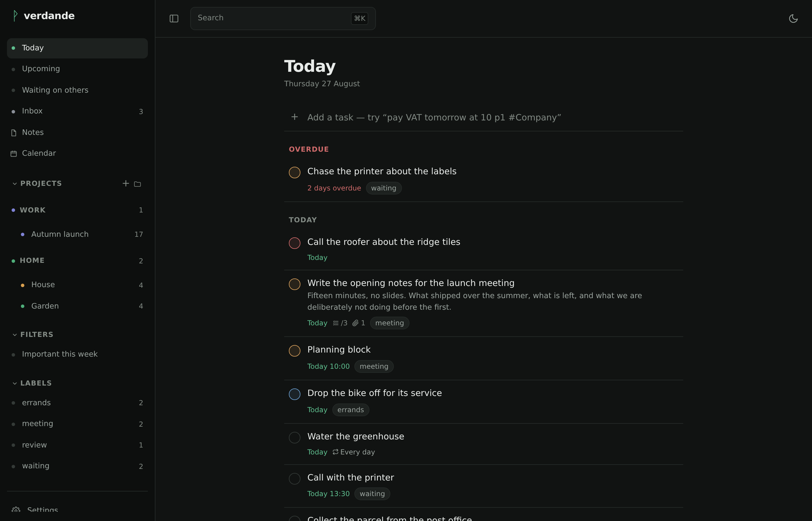
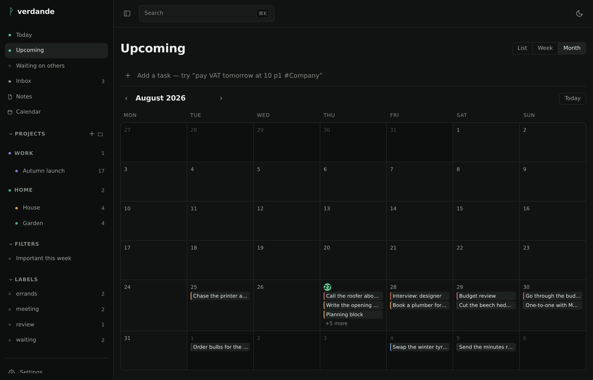
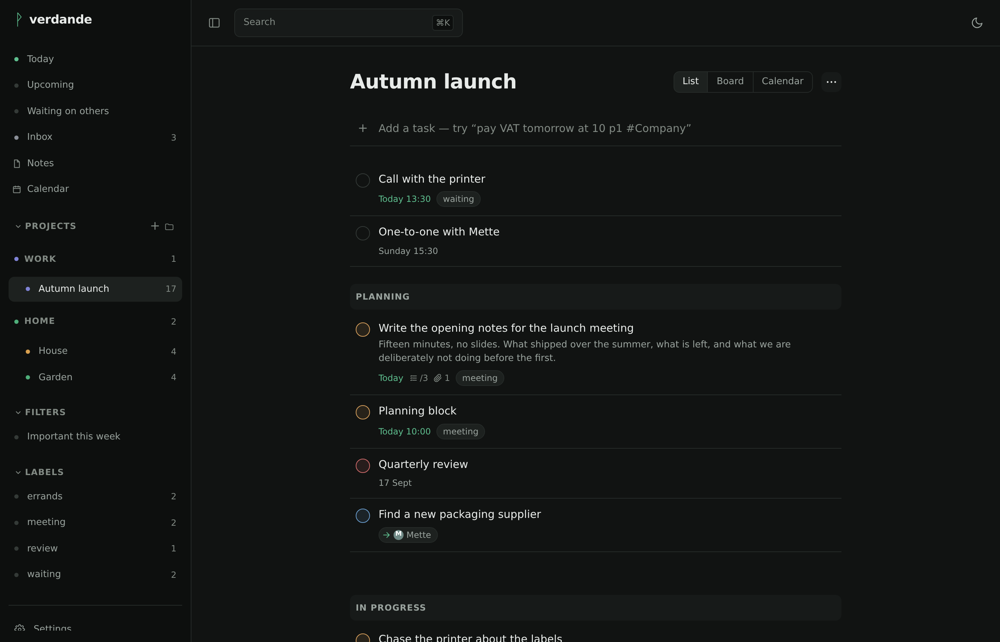
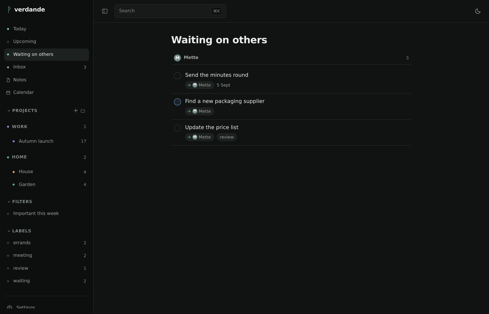
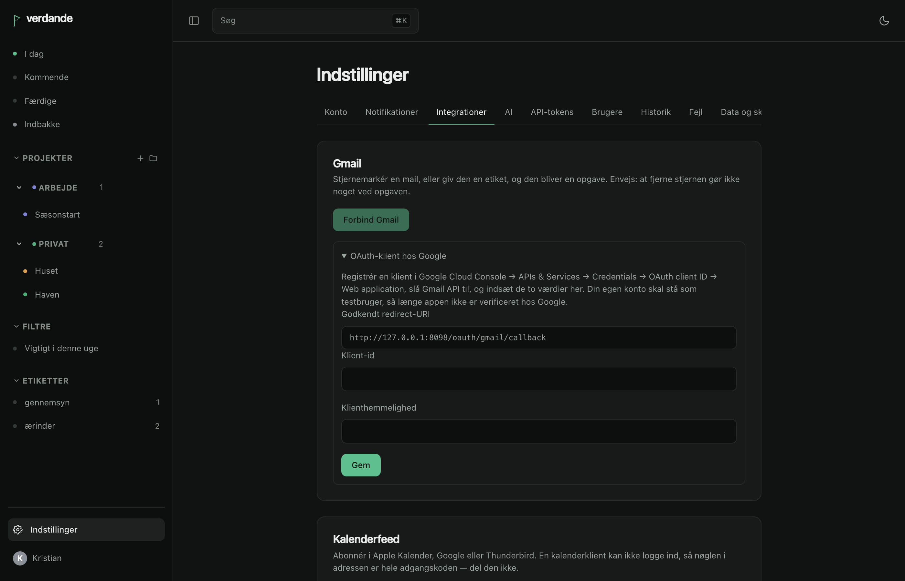
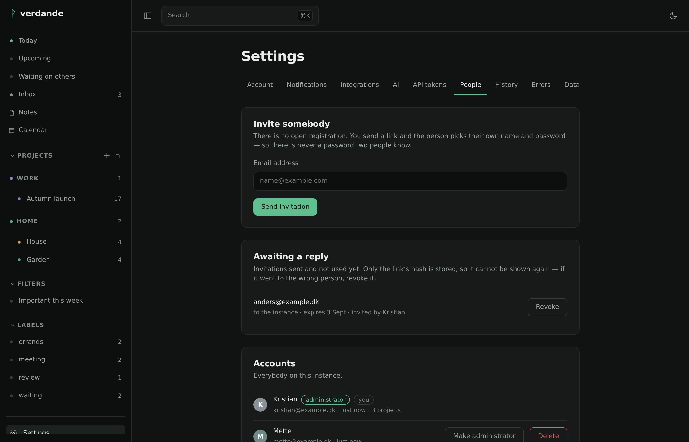

# verdande

Self-hosted tasks and projects, shared with the people you share the work with.
One binary with SQLite inside it — no database to provision, no second process.

**Verdande** is one of the three Norns: the one who spins *that which is becoming*.
Not what has been, and not what is fated to be — the thing you are in the middle
of. Which is what a to-do list is.



## What it is for

Todoist Pro, on your own hardware, with your own data. And with the integrations a
hosted product will not build for you: a real CalDAV server, an address you can
forward mail to, and an MCP endpoint so Claude can work your task list directly.

## What it does

- **[Quick add](quick-add.md) that reads what you type.** `betal moms i morgen kl
  10 p1 #Firma @regnskab` becomes a task due tomorrow at 10:00, priority 1, in
  Firma, labelled regnskab. Danish and English, mixed freely in one line.
- **Projects, sections, sub-tasks, labels, [saved filters](filters.md).** List,
  board and calendar views, and foldable groups over the projects in the sidebar.
  The calendar draws each task to its length — drag the foot to resize, the body
  to move it.
- **Notes, beside the work.** Rich text to write in, Markdown on disk. Share a
  single note with a person, or file it in a project; `#project` and
  `[[another note]]` are links, and a task shows what has been written about it.
- **Delegate, and snooze.** Hand a task to somebody and it is marked with an
  arrow to them, gathered on a *Waiting on others* page. Snooze one to park it,
  greyed, at the foot of the list until a moment you pick — without touching when
  it is due.
- **Drag where it means something** — reorder a list or a board, file a project
  under a group, drop a task on another project, or drop it on another day.
- **Sharing** with owner, editor and viewer roles. Anyone outside your instance
  joins through an invite link.
- **Live sync** — a change made by somebody else appears without a refresh.
- **Repeating tasks** as RRULE, comments and attachments, and reminders that go
  out as Web Push to an iPhone or a Mac.
- **[Calendar](caldav.md), [mail](mail.md) and [Claude](mcp.md)** connected over
  open standards rather than private formats.

## What it looks like



*Upcoming, as a month. A week and a plain list are the other two, and a task can be
dragged from one day onto another.*



*The same project as a list, where sections read as bands. As a board they are
columns.*



*What you have handed to somebody else, grouped by whoever has it — and each row
marked with an arrow to them, so a delegated task reads as delegated wherever you
meet it.*



*Where [Gmail](mailboxes.md), the [calendar feed](caldav.md) and the
[mail-to-task address](mail.md) are connected.*



*Inviting somebody to the instance. There is no open registration — everybody
arrives through a link, and picks their own password. See
[signing in](signing-in.md).*

## Getting it running

verdande is built to be deployed as a **Rune** in
[Yggdrasil Panel](rune.md) — that is its home, and the manifest ships with it. It
runs anywhere Docker does as well.

```bash
docker run -d --name verdande \
  -p 8080:8080 \
  -v verdande-data:/data \
  -e VERDANDE_BASE_URL=https://todo.example.dk \
  ghcr.io/kristianwind/verdande:latest
```

Open the address, create the first account — that account is the administrator.

Running Yggdrasil Panel? [Install it as a Rune](rune.md) instead.

## What it will not do

No karma or points. No team workspaces. No native apps. No mail integration beyond
Gmail and the forwarding address. No languages beyond Danish and English. And no
sync protocol of its own — [CalDAV](caldav.md) and the [API](api.md) *are* the
sync.
